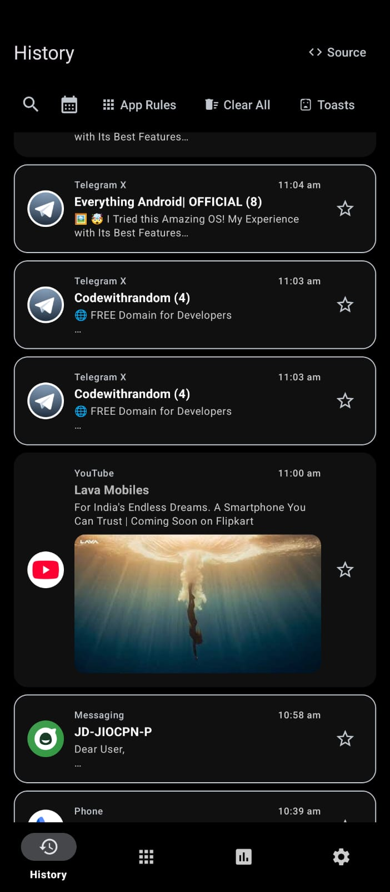
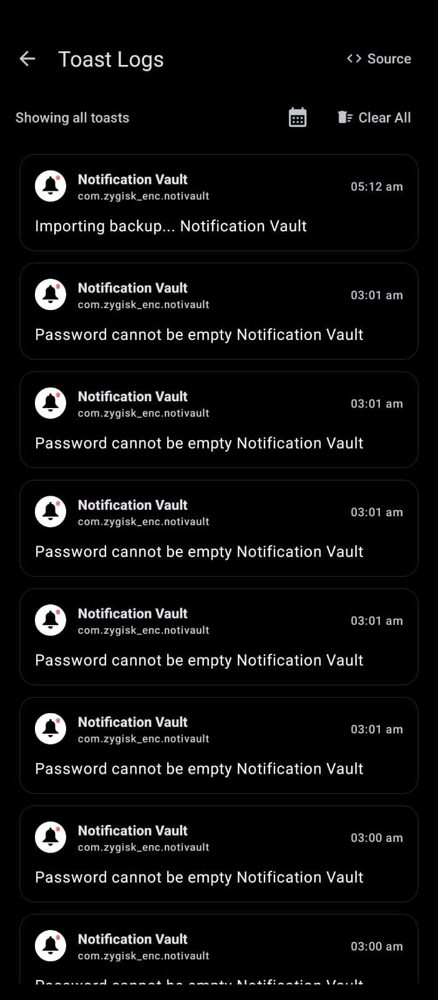
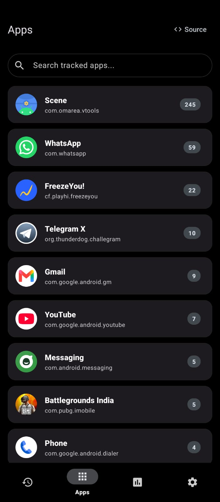
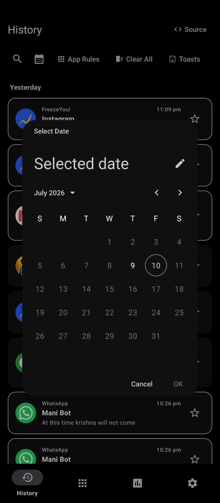
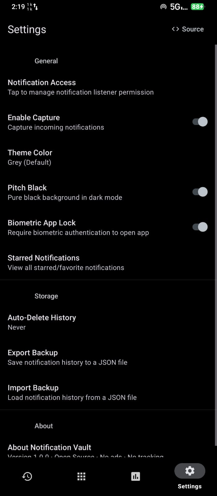
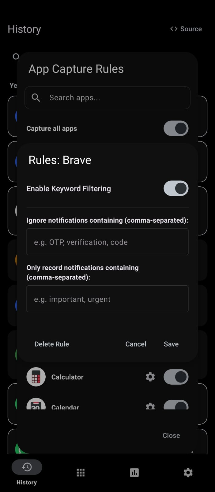
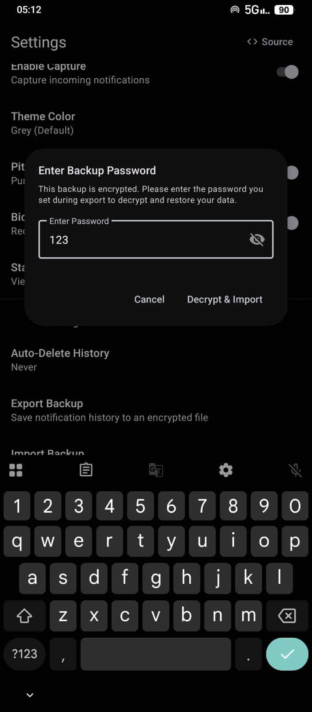
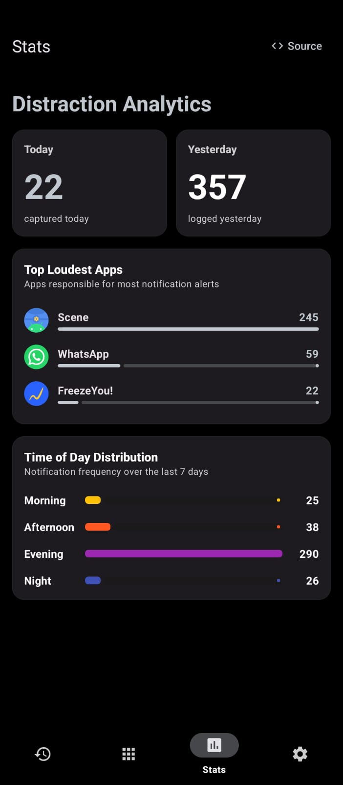
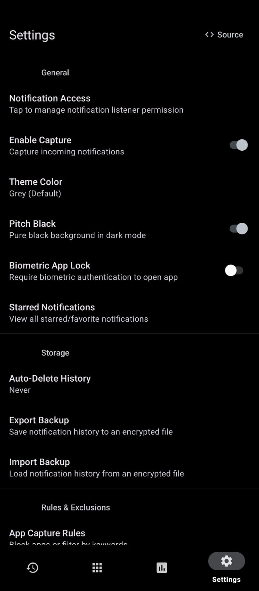

  <h1>Notification Vault</h1>
  
A private, secure, open-source notification logger and history manager.

  
    

  
  
  
  

---

**Notification Vault** securely logs and manages your device's notification history entirely locally. Engineered for privacy and convenience, it ensures you never miss a notification or toast message, even if they are cleared or dismissed.

---
<h3>Notification Vault securely captures and stores all your notifications locally.</h3>

## Versions & Changelog

*   **v2.0.0 (Current Release)**
    *   **On-Device Encryption:** Full database encryption (AES-256-GCM) protecting notification strings.
    *   **Toast Message Recorder:** Captures system-wide on-screen toast messages using accessibility services.
    *   **Notification Image Logger:** Extracts, encrypts, and stores picture attachments from notifications (e.g., chat images). Includes in-app image viewer and export-to-gallery capability.
    *   **App Rules & Keyword Filtering:** Configure rules per application to block certain notifications entirely or filter incoming entries using block/allow keyword lists.
    *   **Advanced Statistics:** Detailed dashboard displaying notification frequency, hourly breakdowns, and top logging apps.
    *   **Encrypted Backups:** Password-protected backup export and import, with optional media attachments.
    *   **Robust Lifecycle Security:** Biometric app lock (Fingerprint/Face/Device Credential) tied directly to app pauses and resumes.
*   **v1.0.0 (Initial Release)**
    *   Baseline notification capturing, full-text search, basic calendar logging, and local storage.

## Core Features

*   **Absolute Privacy**: Operates entirely offline with zero internet permissions or telemetry. Your data stays on your device.
*   **Cryptographic Security**: Uses the `AndroidKeyStore` to generate and manage a hardware-backed master key. String fields and binary attachments are encrypted at rest using `AES/GCM/NoPadding`.
*   **Smart Auto-Delete**: Configurable rolling retention settings (never, 7, 30, or 90 days) to keep database sizes lean automatically.
*   **Bulk-Clear Starred Protection**: Star/favorite important notifications so they are preserved when performing history clears.

## Security Architecture

*   **Key Management**: Cryptographic keys are generated inside the device secure hardware (TEE/StrongBox) and never exposed to the application.
*   **Self-Healing Keystore**: Built-in auto-healing logic deletes and regenerates keys seamlessly on `KeyPermanentlyInvalidatedException` (which occurs if system biometric profiles are updated), preventing database crashes.
*   **Media Security**: Captured images are decrypted strictly in RAM for display, and never written to plain-text storage unless manually exported to the gallery.

<h3><b>Interface Gallery</b></h3>

 

  
  
  
    
  
  
  
    
  
  
  

## Build Requirements

1. Clone: `git clone https://github.com/snap24/notification-vault.git`
2. Environment: Android Studio Koala+, JDK 21.
3. Target: Minimum SDK 26 (Android 8.0), Target SDK 35 (Android 15).
4. Execution: Run `./gradlew assembleDebug` to build the application locally.

## Available On

## License

This project is licensed under the GNU General Public License v3.0. See [LICENSE](LICENSE) for details.

---

  Maintained by Chinmai H B

