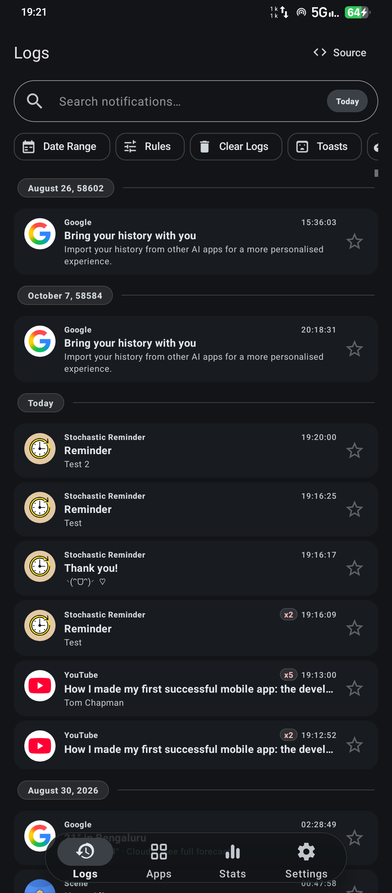
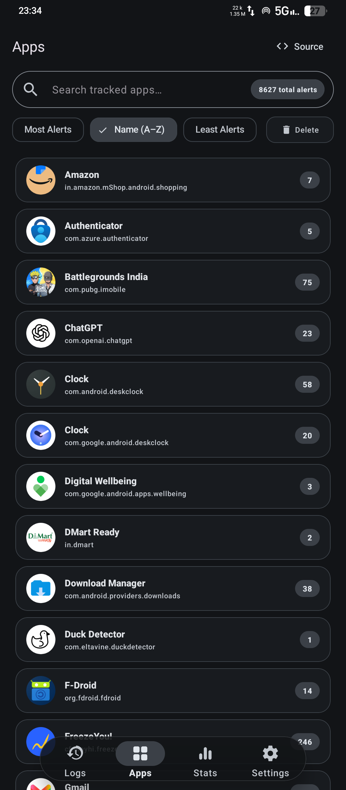
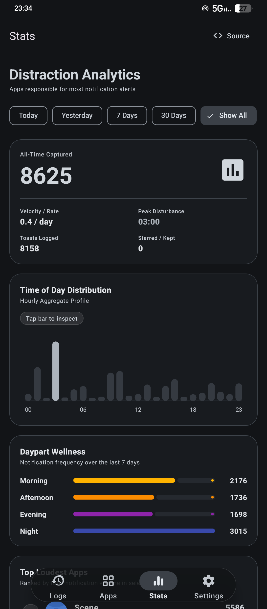
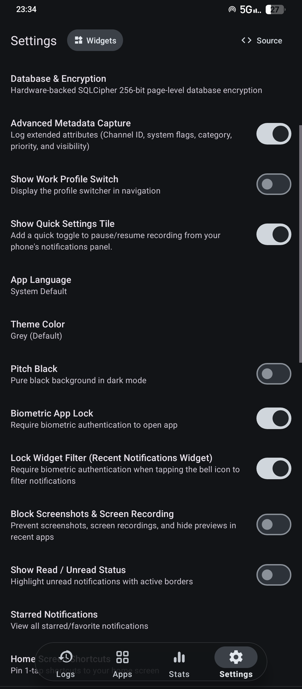
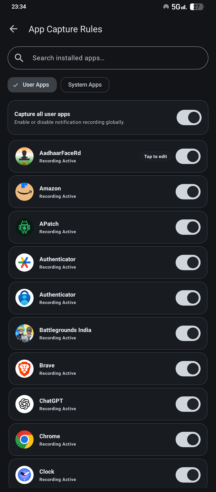
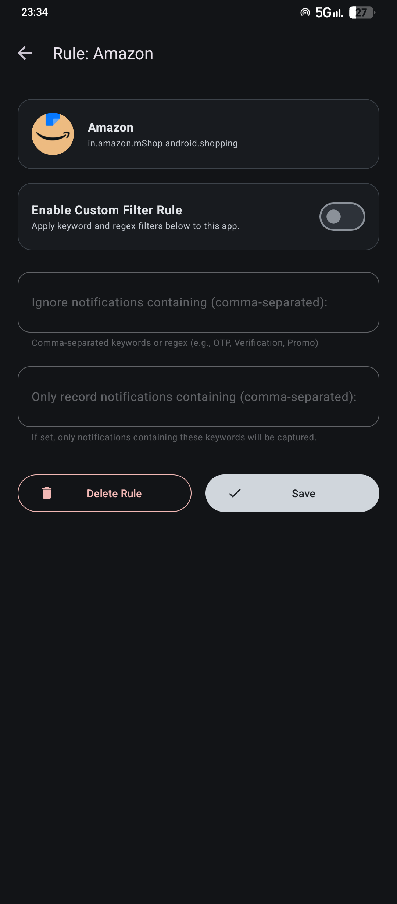
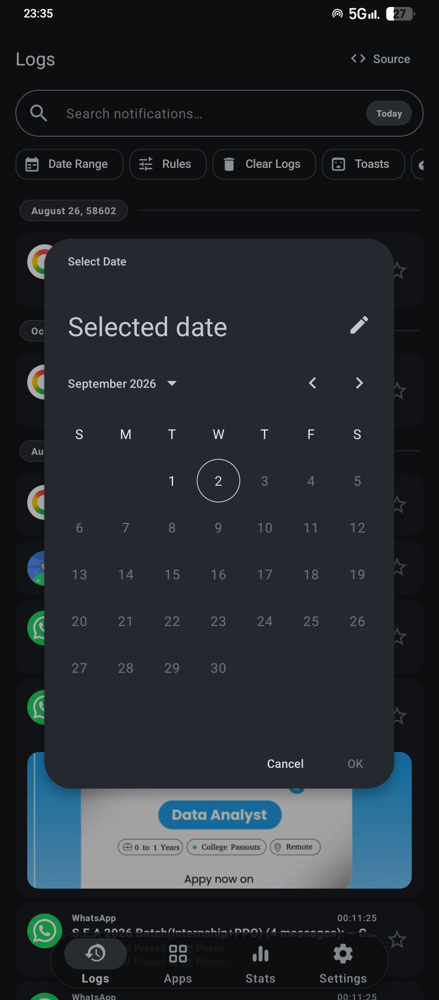
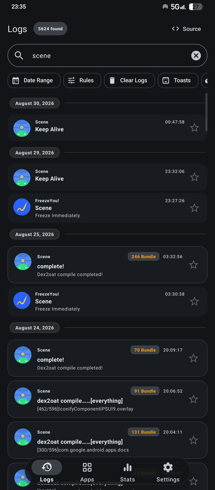
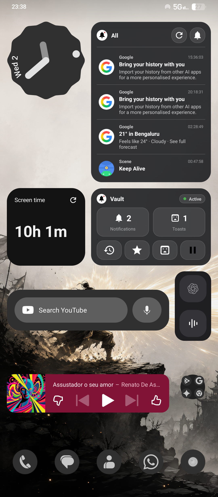

  <h1>Notification Vault</h1>
  
A private, secure, open-source notification logger and history manager.

  
    

  
  
  
  
  

---

**Notification Vault** securely logs and manages your device's notification history entirely locally. Engineered for privacy and convenience, it ensures you never miss a notification or toast message, even if they are cleared or dismissed.

---
<h3>Notification Vault securely captures and stores all your notifications locally.</h3>

## Versions & Changelog

* **v3.0.0 (Current Release)**
  * **SQLCipher 256-bit Encryption**: Hardware-backed whole-database page encryption & instant migration (<150ms).
  * **Sub-5ms Blind Indexing**: Cryptographic token hash indexing for instant full-history search.
  * **Notification Streak Bundling**: Groups 10+ consecutive alerts into compact interactive summary cards.
  * **Material 3 & AMOLED**: Complete visual overhaul, pure black AMOLED mode, and live scrolling date pill.
  * **Streaming Backups**: High-speed streaming backup engine with optional plaintext JSON export.
  * **14 Languages**: 100% translation coverage across all supported locales & stability bug fixes.
* **v2.1.0**
  * Automated scheduled/manual cloud backups via SAF (Google Drive, Nextcloud, etc.).
  * Quick Settings (QS) tile to pause/resume recording directly from status bar.
  * Decryption loops, rendering, and pagination layout fixes.
* **v2.0.1**
  * Fixed v1.0.0 upgrade database migration (`MIGRATION_1_8`).
  * Added AES-256-GCM encryption, toast message recorder, and picture attachment logger.
  * Introduced biometric app lock, per-app keyword rules, and usage statistics.
* **v2.0.0**
  * Initial v2 release *(deprecated due to migration bug; replaced by v2.0.1)*.
* **v1.0.0 (Initial Release)**
  * Core notification capture, basic search, calendar logging, and local storage.

## Core Features

*   **Absolute Privacy**: Operates entirely offline with zero internet permissions or telemetry. Your data stays on your device.
*   **Cryptographic Security**: Uses the `AndroidKeyStore` to generate and manage a hardware-backed master key. String fields and binary attachments are encrypted at rest using `AES/GCM/NoPadding`.
*   **Smart Auto-Delete**: Configurable rolling retention settings (never, 7, 30, or 90 days) to keep database sizes lean automatically.
*   **Bulk-Clear Starred Protection**: Star/favorite important notifications so they are preserved when performing history clears.

## Security Architecture

*   **Key Management**: Cryptographic keys are generated inside the device secure hardware (TEE/StrongBox) and never exposed to the application.
*   **Self-Healing Keystore**: Built-in auto-healing logic deletes and regenerates keys seamlessly on `KeyPermanentlyInvalidatedException` (which occurs if system biometric profiles are updated), preventing database crashes.
*   **Media Security**: Captured images are decrypted strictly in RAM for display, and never written to plain-text storage unless manually exported to the gallery.

<h3><b>Interface Gallery</b></h3>

 

  
  
  
    
  
  
  
    
  
  
  

## Build Requirements

1. Clone: `git clone https://github.com/snap24/notification-vault.git`
2. Environment: Android Studio Koala+, JDK 21.
3. Target: Minimum SDK 26 (Android 8.0), Target SDK 35 (Android 15).
4. Execution: Run `./gradlew assembleDebug` to build the application locally.

## Available On

## License

This project is licensed under the GNU General Public License v3.0. See [LICENSE](LICENSE) for details.

---

  Maintained by Chinmai H B

